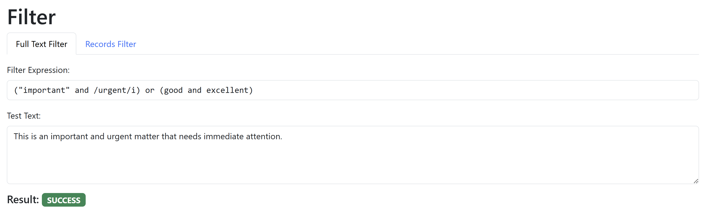
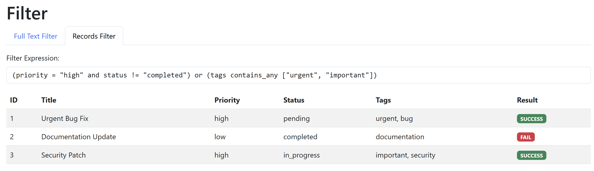

# Filter

Bool filter that can check complex filters against a full text or (nested) records. You can use it e.g. in web crawlers or UIs to be able to define filters similar to the commands in vs code just by typing.

**State:** Implemented with a little help of Windsurf IDE and Claude AI. I just defined the [syntax](#full-syntax), the AI did all the implementation (read the [prompt](ai.md)). I will check different filter combinations over time when I use it.

```
> cd debug_page
> composer install
```






Samples
----------------------------------------------------------

### Full text

```
(("my string" and /some_regex/s) or (string3 and string 4)) and string5
```

### Records

```
((field1 = "my string" and field2 != /some_regex/s) or (field3 in ["string1", "string2"] or nested.field = "string3")) and field4 != "string4"
```


Full syntax
----------------------------------------------------------

nested checks are enclosed with ( ), we use "and" "or" for boolean logic

- types
  - string:          `"my string"`
  - numbers:         `1` or `1.1`
  - bool:            `true`, `false`
  - date and time:   general format: YYYY-MM-DD HH:mm:ss.000...
    - date:          with or without time, seconds or fractions
    - time:          with or without seconds, fractions
  - array:           `[ ... ]`
  - null:            `null`
- case insensitive:  `field = i"string"`, `field != i"string"` (default is sensitive)
- nested fields:     `nested.field = ...`
- equal:             `=`, `!=`
  - we use this for `null` as well
  - for full text arg (no fields) use `and ! "my text"` instead of `!=`
- greater:           `>`,`<`,`>=`,`<=`
  - we also use this for dates
- asterix:           `= "some*"` (we prefer = here over "like")
  - alternative: `field contains "some"`
  - case insesitive: `field = i"some*"`
- regex:             `... = /some_regex/s`

- length:            `myString.length >= 3` for strings and arrays

- arrays

  - in:              `in [ ... ]`, `! in [ ... ]`
  - partial matches: `tags contains_any ["important", "urgent"]`
  - all exist:       `required_fields contains_all ["name", "email", "phone"]`

Advanced

- `scores any > 90` check if any array element matches condition


LICENSE
----------------------------------------------------------

Copyright (C) Walter A. Jablonowski 2024, free under [MIT license](LICENSE)

This app is build upon PHP and free software (see [credits](credits.md))

[Privacy](https://walter-a-jablonowski.github.io/privacy.html) | [Legal](https://walter-a-jablonowski.github.io/imprint.html)
